# chromebook_galliumOS

GalliumOS is een Linux-distro die speciaal is ontworpen om op Chromebooks te worden uitgevoerd. 
Het is de beste 100% Linux-ervaring op Chromebook in mijn ervaring.

  https://www.youtube.com/watch?v=rYYIQwG1vKk

Chromebooks hebben nu de mogelijkheid om Linux-pakketten rechtstreeks vanuit ChromeOS te installeren. Het is echter niet optimaal. Om dit te verhelpen heb ik besloten om mijn #Chromebook dubbel op te starten met #GalliumOS, een distributie op basis van Ubuntu die speciaal is ontworpen voor Chromebooks.
v

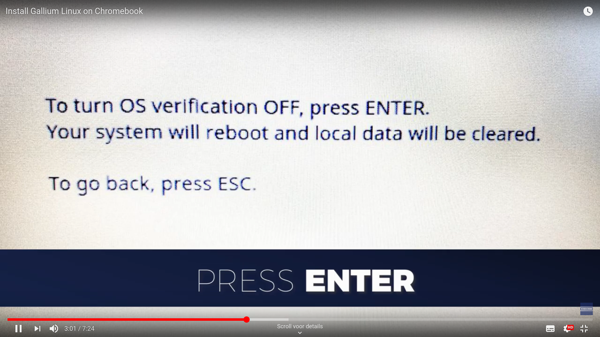
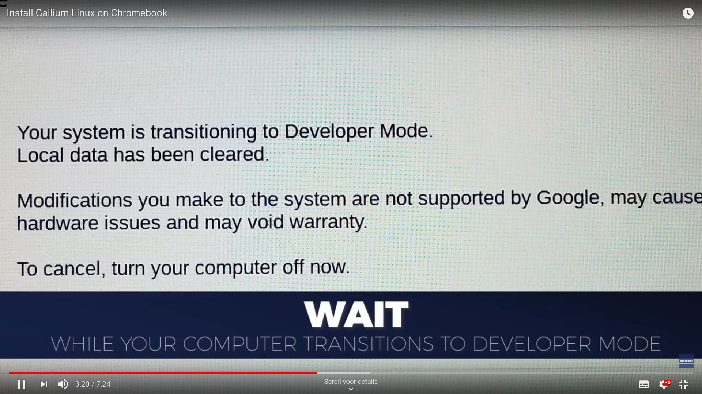
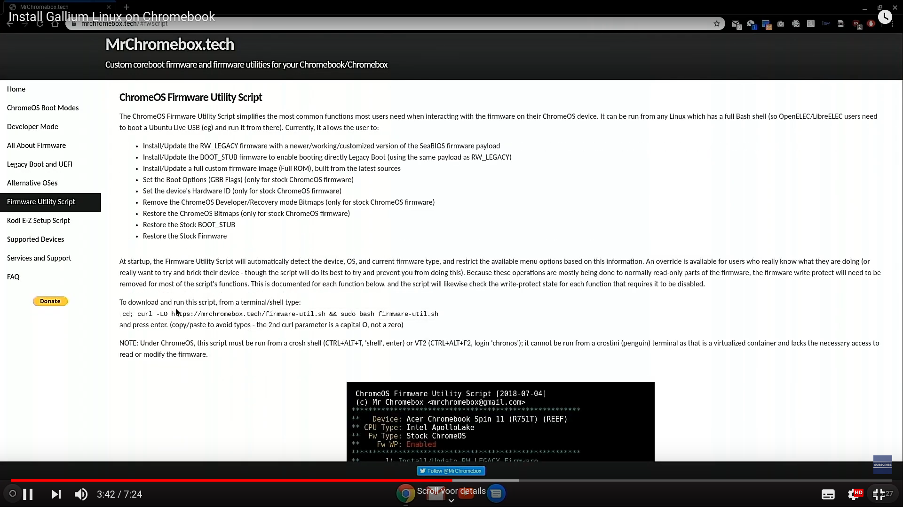
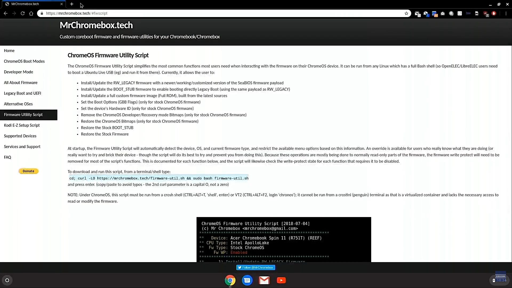
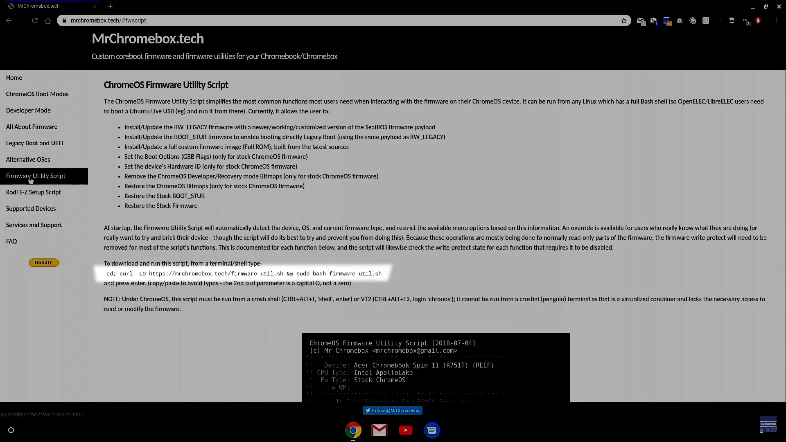
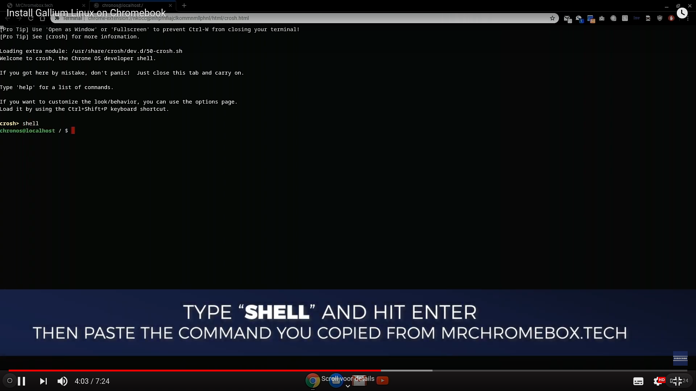
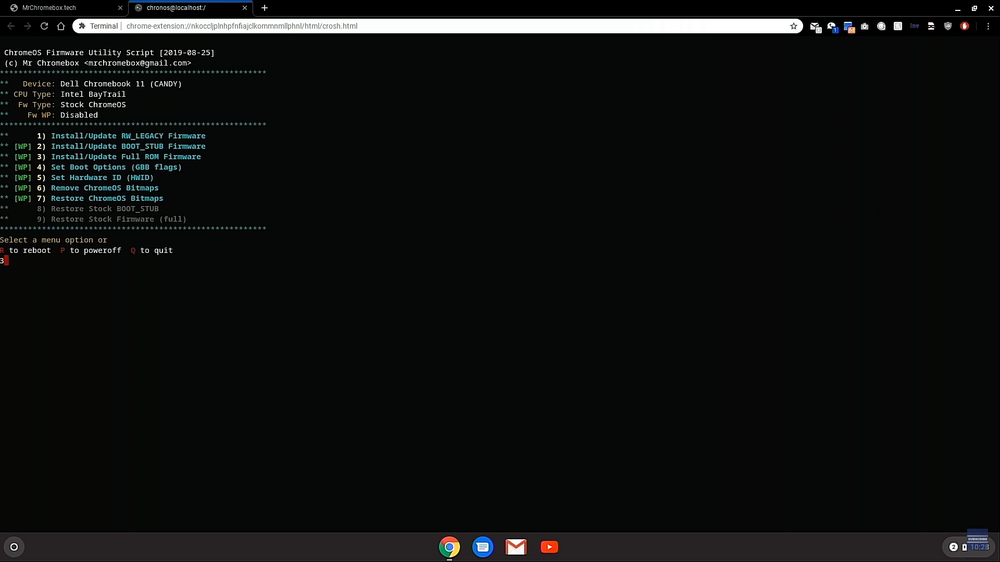
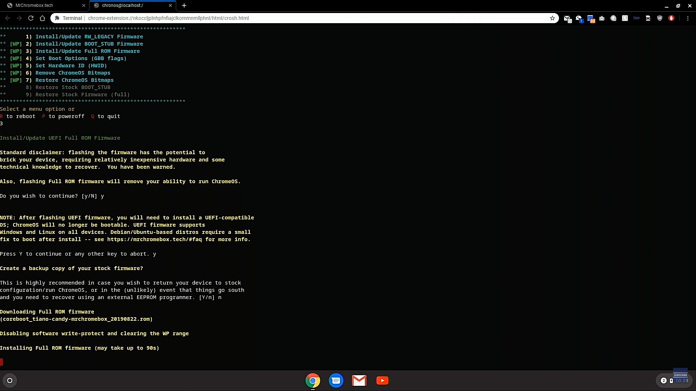

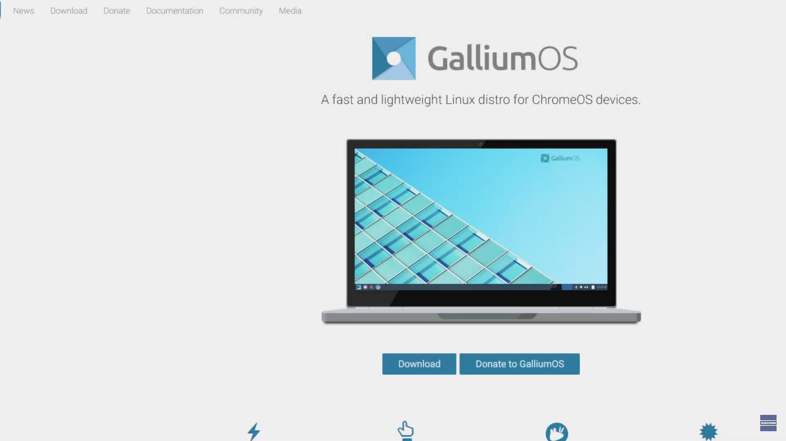

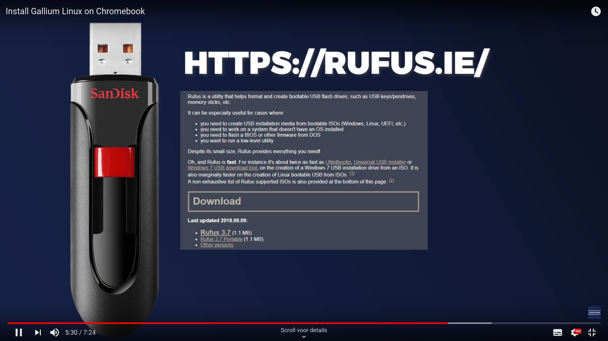
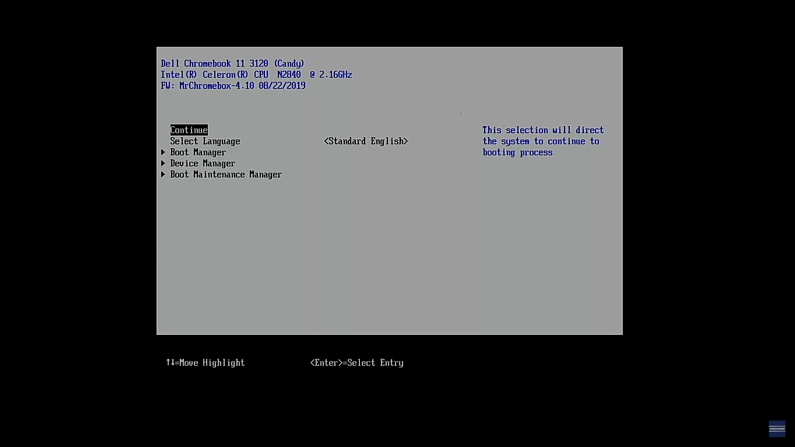
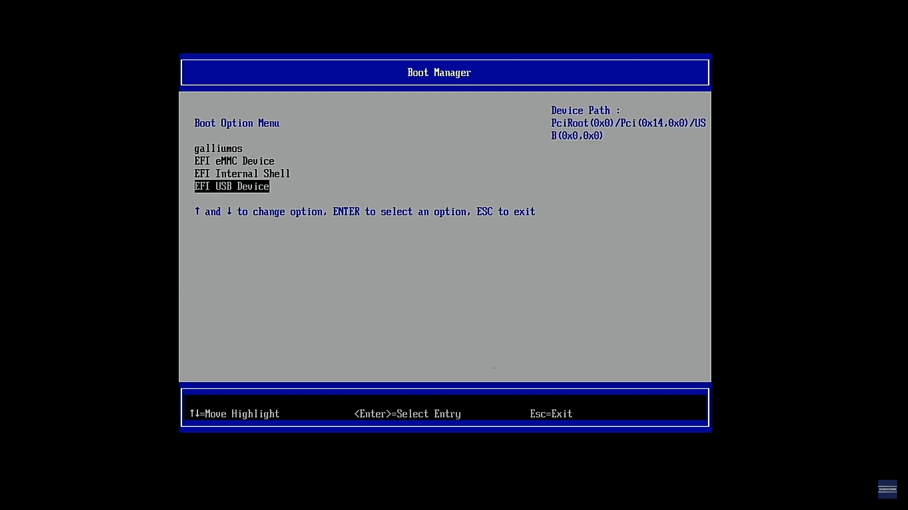
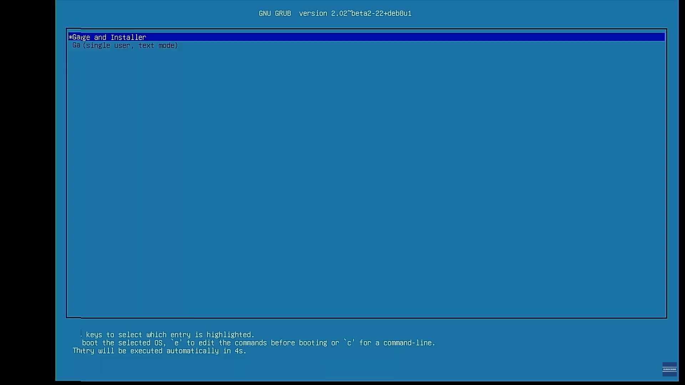
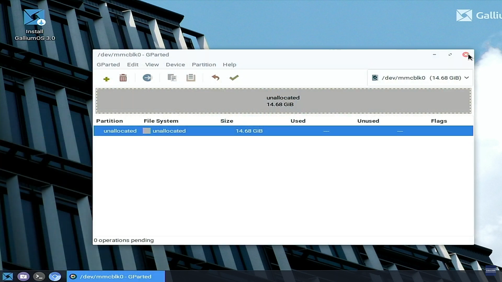
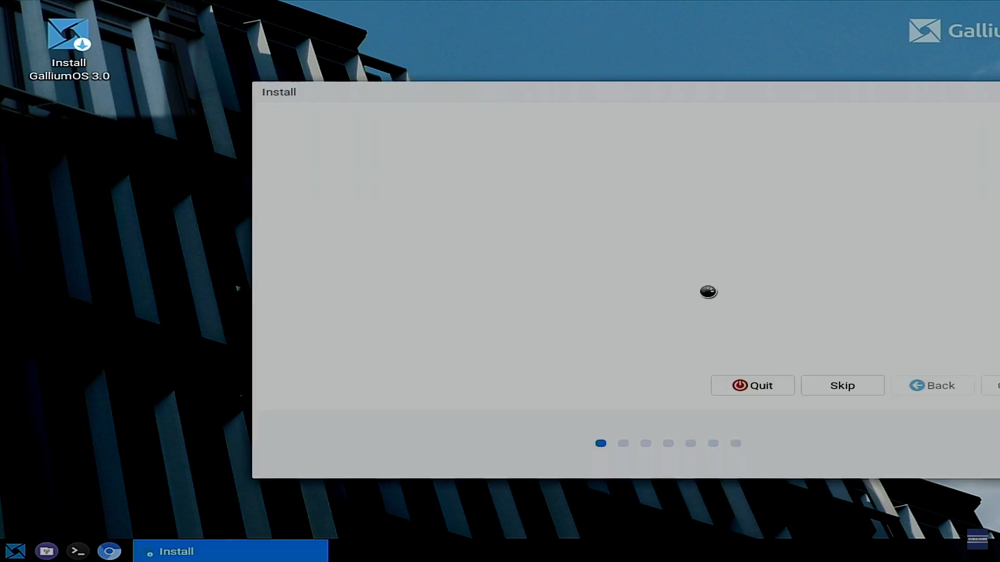
